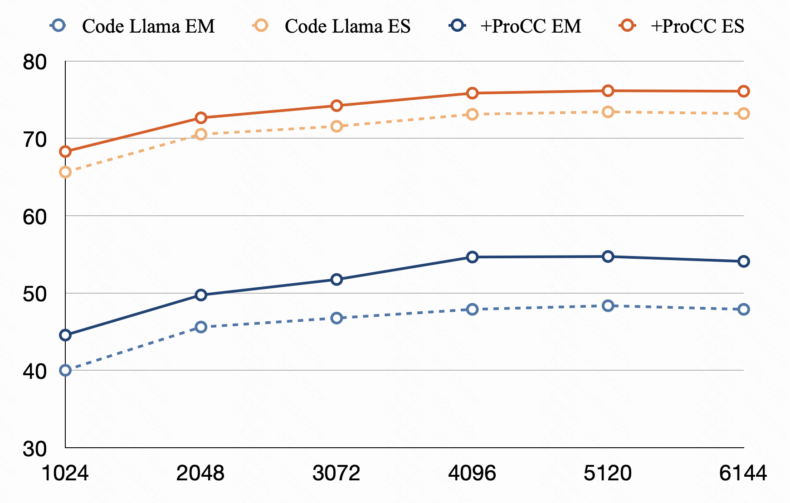
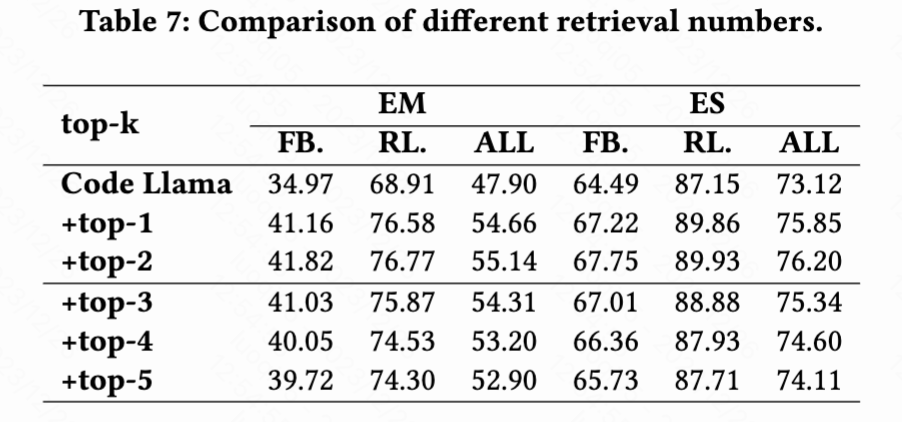

## Introduction
Automated code completion, aiming at generating subsequent tokens from unfinished code, has been significantly benefited from recent progress in pre-trained Large Language Models (LLMs). However, these models often suffer from coherence issues and hallucinations when dealing with complex code logic or extrapolating beyond their training data. Existing Retrieval Augmented Generation (RAG) techniques partially address these issues by retrieving relevant code with a separate encoding model where the retrieved snippet serves as contextual reference for code completion. However, their retrieval scope is subject to a singular perspective defined by the encoding model, which largely overlooks the complexity and diversity inherent in code semantics. To address this limitation, we propose ProCC, a code completion framework leveraging prompt engineering and the contextual multi-armed bandits algorithm to flexibly incorporate and adapt to multiple perspectives of code. ProCC first employs a prompt-based multi-retriever system which crafts prompt templates to elicit LLM knowledge to understand code semantics with multiple retrieval perspectives. Then, it adopts the adaptive retrieval selection algorithm to incorporate code similarity into the decision-making process to determine the most suitable retrieval perspective for the LLM to complete the code. Experimental results demonstrate that ProCC outperforms state-of-the-art code completion technique by 8.6% on our collected open-source benchmark suite and 10.1% on the private-domain benchmark suite collected from a billion-user e-commerce company in terms of Exact Match. ProCC also allows augmenting fine-tuned techniques in a plug-and-play manner, yielding 5.6% improvement over our
studied fine-tuned model.

## QuickStart
### Install requirements
Before start, please install [text-generation-inference v1.1.1](https://github.com/huggingface/text-generation-inference) for inference and [LMflow v0.0.4](https://github.com/OptimalScale/LMFlow) for training.
Then install the requirements libraries.
```bash
pip install -r requirements.txt
```
Also please download the [starcoder](https://huggingface.co/bigcode/starcoderbase) and [codellama](https://huggingface.co/codellama/CodeLlama-13b-Instruct-hf) model from HuggingFace, they are base models.

## Supplementary experiment
1. Prompt length experiment. 

    For the optimal trade-off between computational expenditure and model efficacy, the maximum input length for the model was set to 4096 tokens, aligning with the training configuration of the Code Llama. This section critically assesses the influence of the maximum input length on model performance. The model generation performances associated with varying input lengths are demonstrated in figure bellow.

    
    
    As shown in the figure, extending the input context length generally promotes completion performance due to the inclusion of a more extensive information set. Nevertheless, the incremental benefits tend to plateau as the input length reaches 4096 tokens. It is also important to note that a significant increase in computational load is observed; for instance, the latency escalates from 0.1070 seconds to 0.2533 seconds when the input length is extended from 1024 to 6144 tokens. Thus, it is essential to consider the balance between computational efficiency and performance enhancement.

2. Retrieval snippets number experiment.

    In the established baseline experiments, concatenation of the most closely matched retrieved code snippet into the prompt is employed to improve the generative performance of the LLM. This section is dedicated to investigating the impact of integrating multiple retrieval results on the model's generative efficacy.
    
    
    
    As illustrated in Table 7, the LLM achieves peak performance when it is provided with a dual set of retrieved contexts. The performance degradation observed with a greater number of retrievals may be attributed to an over-saturation of information, which scatters the LLM's focus and affects its generative capabilities.
